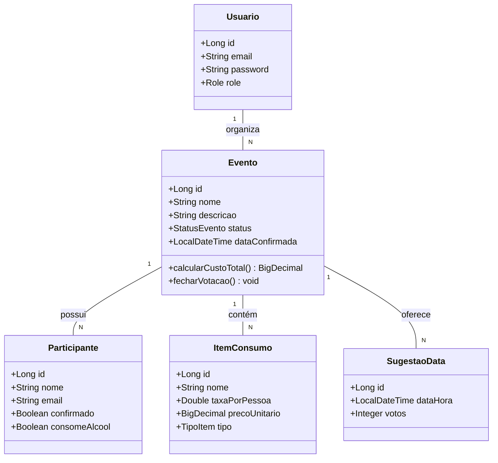

# OrganizaAí - Gestão de Eventos

---

Lucas do Nascimento Lima - 11231101214 <br>
Diogo Mendes Baptista - 11231101219

---


<!-- Badges -->
<div align="center">

[](https://www.umc.br/)


</div>

---

##  Sobre o Projeto
O OrganizaAí é uma solução robusta em formato de API RESTful, desenvolvida com o que há de mais moderno no ecossistema Java 21. O projeto nasceu para sanar uma dor comum no convívio social: a fricção logística na organização de eventos em grupo.

Desde a indefinição de datas que gera conversas infinitas em aplicativos de mensagens até a dificuldade matemática de calcular insumos e custos por pessoa, o OrganizaAí centraliza e automatiza todo o ciclo de vida de um evento.

---

## Funcionalidades do Projeto

📅 **Gestão de Eventos e Datas**

- Criação de Eventos: Permite criar eventos personalizados (Churrascos, Reuniões, Festas).

- Votação de Datas: O organizador propõe múltiplas datas e os participantes votam nas que têm disponibilidade (estilo Doodle).

- Fechamento Automático: O sistema identifica a data com maior adesão para confirmar o evento.

🍖 **Gerenciamento de Insumos**

- Cálculo por Pessoa: Cálculo automático de quantidades (ex: gramas de carne, litros de bebida) com base no número de confirmados.

- Divisão de Custos: Gestão financeira para saber quanto cada participante deve contribuir.

- Lista de Compras: Geração de lista de itens necessários para a realização do evento.

🔐 **Segurança e Controle (Security by Design)**

- Autenticação JWT: Acesso seguro via Tokens para garantir que apenas usuários autorizados interajam com os eventos.

- Níveis de Acesso: Diferenciação entre organizadores (quem criou o evento) e participantes.

- Proteção de Dados: Implementação de filtros de segurança para evitar acessos indevidos a informações privadas de grupos.

---

## Estrutura do Repositório
```text
organiza-ai/
├── src/
│   ├── main/
│   │   ├── java/com/organizaai/
│   │   │   ├── config/          # Configurações (SecurityConfig, JWT, OpenAPI)
│   │   │   ├── controller/      # Endpoints da API (REST)
│   │   │   ├── enums/           # Enumerações (ex: role do usuário)
│   │   │   ├── model/           # Entidades do Banco de Dados (JPA)
│   │   │   ├── repository/      # Interfaces de acesso ao Banco (Spring Data JPA)
│   │   │   ├── service/         # Regras de negócio e lógica do sistema
│   │   │   └── OrganizaAiApplication.java
│   │   └── resources/
│   │       ├── static/images/   # Assets, logos e imagens do README
│   │       ├── templates/       # Templates
│   │       └── application.properties
│   └── test/                    #
├── .env.example                 # Exemplo de variáveis de ambiente
├── .gitignore                   # Arquivos ignorados pelo Git (target, .env)
├── pom.xml                      # Gerenciador de dependências Maven
└── readme.md                    # Documentação principal do projeto
```
---
## Arquitetura do Sistema

Abaixo está o diagrama de classes atualizado, baseado na modelação do sistema OrganizaAí:



Notas sobre a Modelação:

Cálculo de Insumos: A lógica de consomeAlcool no Participante permite que o sistema filtre quem entra no cálculo de bebidas alcoólicas vs. refrigerantes/água.

Financeiro: O precoUnitario no ItemConsumo possibilita o método calcularCustoTotal() no Evento.

Fluxo de Decisão: O SugestaoData armazena os votos antes de o status do evento mudar e a dataConfirmada ser preenchida.

---
## Como Executar
1. Clone o repositório.
2. Configure o seu `.env` (veja o `.env.example`).
3. Execute o comando `./mvnw spring-boot:run`.

---
